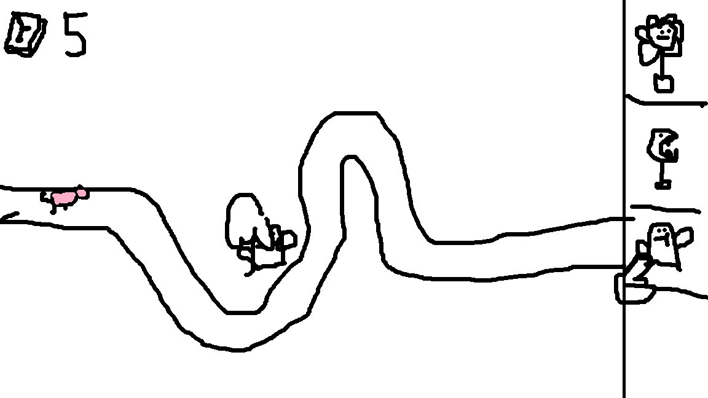

# Sprint 0 - Game Design Document : Tower Defense

Naam: Jonah Luijnenbrug

Klas: SD2B

Datum: 8/09/2025

## 1\. Titel en elevator pitch

Titel: Plants vr piggies

Elevator pitch, maximaal twee zinnen:
Plants, because the mechanic makes sense with the upgrade mechanic. piggies because they give a comedic effect

Beschrijf kort wat jouw game is en waarom het leuk is om te spelen:
its addicting to see how far you can survive and how much money you can get.

## 2\. Wat maakt jouw tower defense uniek

Beschrijf in één of twee zinnen wat jouw game onderscheidt van een standaard tower defense. Denk aan iets dat de speler op een nieuwe manier laat nadenken of spelen:
every round you can choose a card for example extra dammage for all plants.

## 3\. Schets van je level en UI

## 4\. Torens

Toren 1 naam, bereik, schade, unieke eigenschap.
Plant, hits close, little damage, first tower

Toren 2 naam, bereik, schade, unieke eigenschap.
cactus, sees far, mid damage, shoots homing thorns

Eventuele extra torens: Wip

## 5\. Vijanden

Vijand 1 naam, snelheid, levens, speciale eigenschap.
pink piggie, slow speed, one life, first piggie

Vijand 2 naam, snelheid, levens, speciale eigenschap.
red piggie, medium speed, one life, splits into 2 pink piggies

Eventuele extra vijanden: Wip

## 6\. Gameplay loop

Beschrijf in drie tot vijf stappen wat de speler steeds doet.
1. buy tower

2. kill enemies
3. get money
4. upgrade tower
5. get extra card

## 7\. Progressie

Leg uit hoe het spel moeilijker wordt naarmate de waves doorgaan. Denk aan sterkere vijanden, kortere tussenpozen, hogere kosten of lagere beloningen.
towers get more prized the more of that type you have. the piggies get more strong and faster the further you go

## 8\. Risico’s en oplossingen volgens PIO

* Probleem 1:
* Impact:
* Oplossing:
* Probleem 2:
* Impact:
* Oplossing:

* Probleem 3:
* Impact:
* Oplossing:

## 9\. Planning per sprint en mechanics

Schrijf per sprint welke mechanics jij oplevert in de build. Denk aan voorbeelden zoals vijandbeweging over een pad, torens plaatsen, doel kiezen en schieten, waves starten, UI voor geld en levens, upgrades, jouw unieke feature.

Sprint 1 mechanics: Piggies movement and tower placement

Sprint 2 mechanics: towers can shoot and upgrade system

Sprint 3 mechanics: wave system and economy

Sprint 4 mechanics: card mechanic and piggies can have special abilities

Sprint 5 mechanics: polishing

## 10\. Inspiratie

Noem een bestaande tower defense game die jou inspireert en wat je daarvan meeneemt of juist vermijdt.
Bloons TD6 upgrade mechanic and tower placement
Plants Vr Zombies i dont want the linear gameplay that it can have sometimes

## 11\. Technisch ontwerp mini

Lees dit korte voorbeeld en vul daarna jouw eigen keuzes in.

Voorbeeld ingevuld bij 11.1 Vijandbeweging over het pad

* Keuze:
  Vijanden volgen punten A, B, C en daarna de goal.
* Risico:
  Een vijand loopt een punt voorbij of blijft hangen.
* Oplossing:
  Als de vijand dichtbij genoeg is kiest hij het volgende punt. Bij de goal gaat één leven omlaag en verdwijnt de vijand.
* Acceptatie:
  Tien vijanden lopen van start naar de goal zonder vastlopers en verbruiken elk één leven.
  Alle tien vijanden bereiken achtereenvolgens elk waypoint binnen één seconde na elkaar.

### 11.1 Vijandbeweging over het pad

* Keuze: go to a b c then to end
* Risico: enemy can get stuck
* Oplossing: set a range of when the enemy is at a point go to next
* Acceptatie: 30 enemy's can walk over a point and all do dammage to the end

### 11.2 Doel kiezen en schieten

* Keuze: calculate where the pig and the thorn should be and target there
* Risico: the thorn is 100% precise
* Oplossing: give a bit of randomness to where it shoots
* Acceptatie: fire a shot 20 times and see how many make it. also the closer the piggy is the more accurate it should be

### 11.3 Waves en spawnen

* Keuze: spawn the piggies with a set dalay
* Risico: i dont know
* Oplossing:
* Acceptatie:

### 11.4 Economie en levens

* Keuze: give the player money based on what type and how many enemys are killed
* Risico:
* Oplossing:
* Acceptatie:

### 11.5 UI basis

* Keuze:
* Risico:
* Oplossing:
* Acceptatie:
