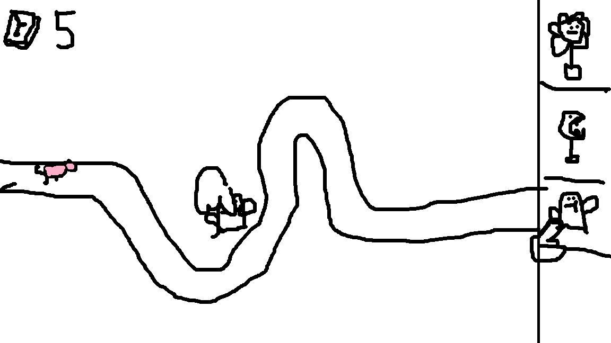

Build: <a href="/Build">Build</a>

# Sprint 0 - Game Design Document : Tower Defense

Name: Jonah Luijnenbrug

Datum: 8/09/2025

## 1\. Title and elevator pitch

Titel: Plants vr balloons

Elevator pitch:
Plants, because the mechanic makes sense with the upgrade mechanic. balloons because plastic and rubber in nature us not good so the plants are stopping them

Desctibe what your game is, and what makes it so special:
its addicting to see how far you can survive and how much money you can get.

## 2\. Whats uniqe in your game

every round you can choose a card for example extra dammage for all plants.  (Got scrapped due to time)

## 3\. Draw the vision for your game

## 4\. Towers

Tower 1 attributes
Plant, hits close, little damage, first tower

Tower 2 attributes
cactus, sees far, mid damage, shoots homing thorns

## 5\. Enemies

Enemy 1 attributes
yellow balloon, slow speed, one life, first baloon

Enemy 2 attributes
red baloon, medium speed, one life, splits into 2 yellow balloon

## 6\. Gameplay loop

1. buy tower
2. kill enemies
3. get money
4. upgrade tower
5. get extra card

## 7\. Progression

Explain the progression in yoir game
towers get more prized the more of that type you have. the balloon get more strong and faster the further you go

## 8\. Insparation

Bloons TD6 upgrade mechanic and tower placement
Plants Vr Zombies i dont want the linear gameplay that it can have sometimes

## 9\. Technisch ontwerp mini

Explain some of your mechanics and name any problem you came across

### 9.1 Choose baloon and shoot

* Choice: calculate where the balloon and the thorn should be and target there
* Risk: the thorn is 100% precise
* Solved: give a bit of randomness to where it shoots
* Acceptable: fire a shot 20 times and see how many make it. also the closer the piggy is the more accurate it should be
